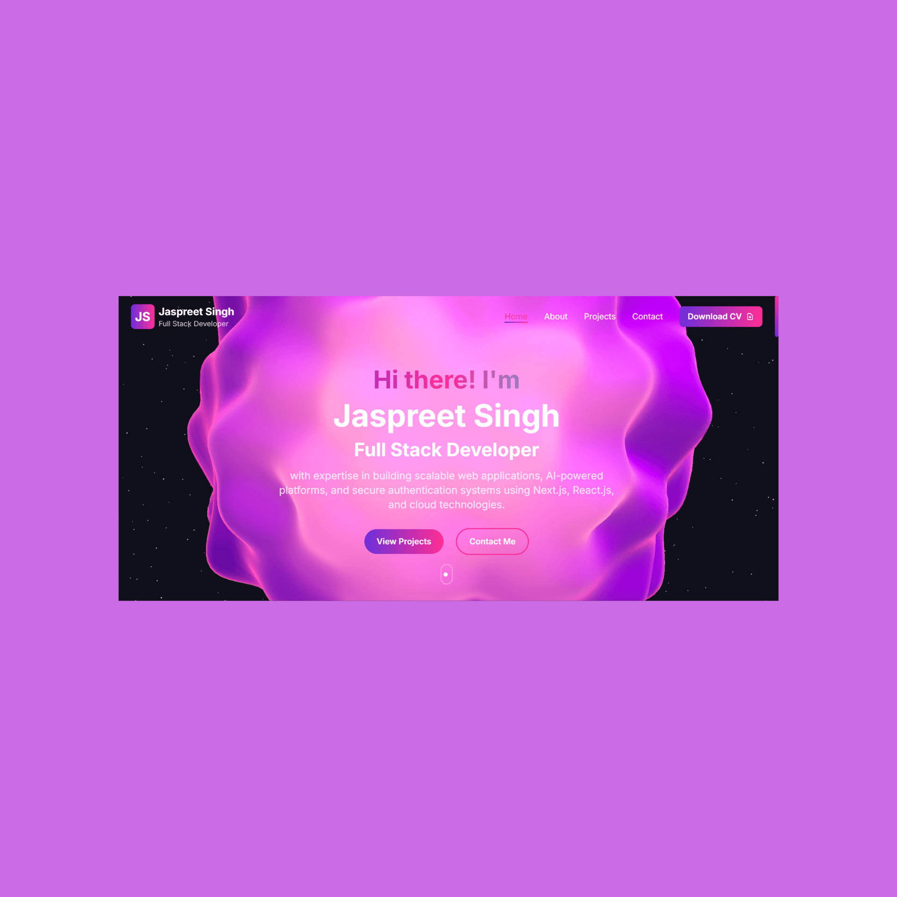
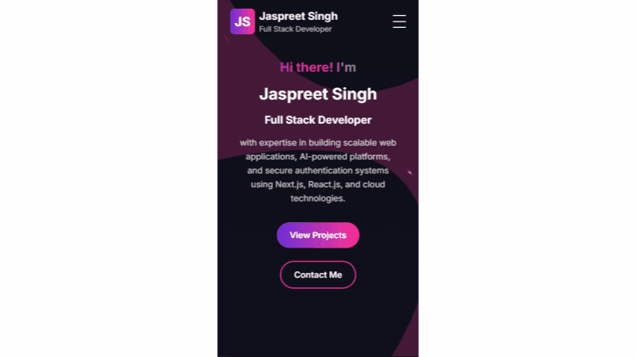

# 🚀 Modernfolio - Next.js Portfolio

<div align="center">
  
  <!-- Animated Header -->
  
  
  <!-- Project Banner -->
  

  <!-- Badges -->
  <p>
    
    
    
    
    
  </p>

  <!-- Quick Links -->
  <p>
    <a href="https://www.jaspreet.me" target="_blank">
      
    </a>
    <a href="https://github.com/Jaspreet000/modernfolio/issues" target="_blank">
      
    </a>
    <a href="https://github.com/Jaspreet000/modernfolio/issues" target="_blank">
      
    </a>
  </p>

  <!-- Social Badges -->
  <p>
    <a href="https://github.com/Jaspreet000" target="_blank">
      
    </a>
    <a href="https://twitter.com/Jaspreeeeeeeet" target="_blank">
      
    </a>
  </p>

  <!-- Animated Divider -->
  
</div>

<!-- Project Overview -->
## 🌟 Project Overview

<div align="center">
  
</div>

ModernFolio is a cutting-edge portfolio template built with the latest web technologies. It features:

<table>
  <tr>
    <td>
      
    </td>
    <td>
      <h3>🎮 Interactive 3D Elements</h3>
      <p>Immersive 3D experiences powered by Three.js and Spline</p>
    </td>
  </tr>
  <tr>
    <td>
      
    </td>
    <td>
      <h3>📱 Responsive Design</h3>
      <p>Perfectly adapts to any device or screen size</p>
    </td>
  </tr>
  <tr>
    <td>
      
    </td>
    <td>
      <h3>⚡ Blazing Fast</h3>
      <p>Optimized for performance with 90+ Lighthouse score</p>
    </td>
  </tr>
</table>

## ✨ Features

<div align="center">
  <table>
    <tr>
      <td align="center">
        
        <br />
        Modern Design
      </td>
      <td align="center">
        
        <br />
        3D Elements
      </td>
      <td align="center">
        
        <br />
        Responsive
      </td>
    </tr>
    <tr>
      <td align="center">
        
        <br />
        Performance
      </td>
      <td align="center">
        
        <br />
        Animations
      </td>
      <td align="center">
        
        <br />
        Interactive
      </td>
    </tr>
  </table>
</div>

## 🚀 Getting Started

### Prerequisites

- Node.js 18+ and npm
- Git

### Installation

```bash
# Clone the repository
git clone https://github.com/Jaspreet000/modernfolio.git

# Navigate to the project
cd modernfolio

# Install dependencies
npm install

# Start development server
npm run dev
```

## 📁 Project Structure

```bash
modernfolio/
├── src/
│   ├── app/           # Next.js app directory
│   ├── components/    # Reusable components
│   ├── hooks/         # Custom React hooks
│   ├── styles/        # Global styles
│   └── types/         # TypeScript types
├── public/           # Static assets
└── package.json     # Project dependencies
```

## ⚡ Performance

<div align="center">
  
</div>

## 🗺️ Roadmap

- [x] Launch initial version
- [x] Add 3D interactions
- [x] Implement blog section
- [ ] Add dark/light theme
- [ ] Add more animations
- [ ] Add i18n support

## 🤝 Contributing

<table>
  <tr>
    <td>
      <a href="https://github.com/Jaspreet000/modernfolio/fork">
        
        <br />
        Fork Project
      </a>
    </td>
    <td>
      <a href="https://github.com/Jaspreet000/modernfolio/issues">
        
        <br />
        Report Bug
      </a>
    </td>
    <td>
      <a href="https://github.com/Jaspreet000/modernfolio/issues">
        
        <br />
        Request Feature
      </a>
    </td>
  </tr>
</table>

## 📝 License

Distributed under the MIT License. See [`LICENSE`](LICENSE) for more information.

## 📫 Contact

<div align="center">
  <a href="https://www.jaspreet.me">
    
  </a>
  <a href="https://linkedin.com/in/jaspreeet-singh">
    
  </a>
  <a href="https://twitter.com/Jaspreeeeeeeet">
    
  </a>
</div>

<div align="center">
  
  <p>If you found this project interesting, please consider giving it a ⭐!</p>
  
  <a href="https://github.com/Jaspreet000/modernfolio">
    
  </a>
  
  <p>Made with ❤️ by <a href="https://github.com/Jaspreet000">Jaspreet Singh</a></p>

  <!-- Visitor Counter -->
  
</div>
